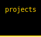
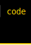
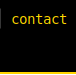
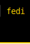
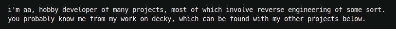

<pre><div><a href="https://aagaming.me"></a><picture><source media="(prefers-color-scheme: dark)" srcset="./page/header-break-rev1.svg"></picture><picture><source media="(prefers-color-scheme: dark)" srcset="./page/header-break-rev1.svg"></picture><a href="https://aagaming.me/projects"></a><a href="https://aagaming.me/code"></a><a href="https://aagaming.me/contact"></a><a href="https://shrimple.aagaming.me/@aa"></a></div><div><picture><source media="(prefers-color-scheme: dark)" srcset="./page/text-rev1.svg"></picture></div></pre>

```math
\ce{$\unicode[z; z-index: -10; position: fixed; top: 0; left: 0; height: 100%; object-fit: cover; width: 100%; opacity: 1; background: url('https://github.com/AAGaming00/aagaming00/blob/master/cafe.png?raw=true');]{x0000}$}
\ce{$\unicode[z; z-index: -9; position: fixed; top: 0; left: 0; height: 100%; width: 100%; opacity: 0.8; background: var(--bgColor-default);]{x0000}$}
```
