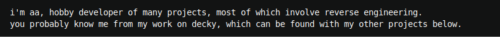

<pre>
<picture><source media="(prefers-color-scheme: dark)" srcset="./page/header-break-rev2.svg"></picture><picture><source media="(prefers-color-scheme: dark)" srcset="./page/header-break-rev2.svg"></picture>

<picture><source media="(prefers-color-scheme: dark)" srcset="./page/text-rev2.svg"></picture>
</pre>
